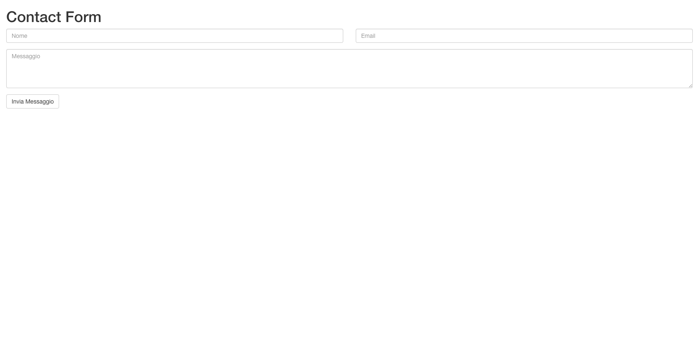

# phpContact
Is an html form for send emails, usually used for contact forms. Uses `jqBootstrapValidation.js`, used for the data 
validation. 

## use
for use this form is required PHP 7.2.1, clone the repository on your local machine.
```
git clone https://github.com/giuliobosco/phpContact.git
```
Then copy the html code in your project and fix the dependencies.

## view
